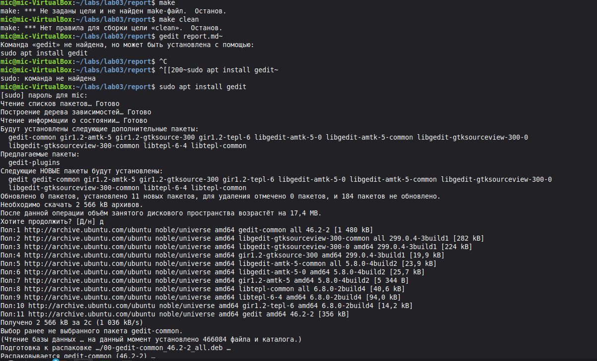
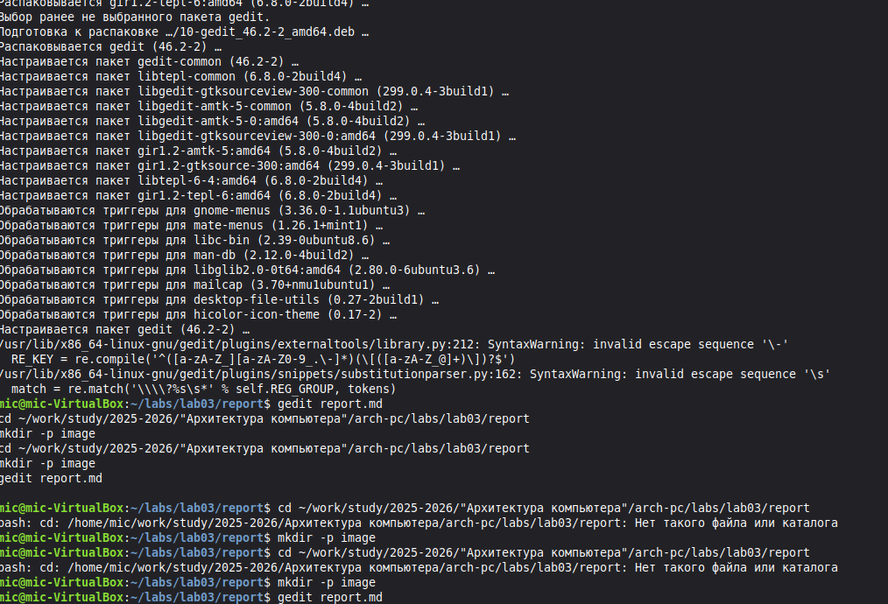
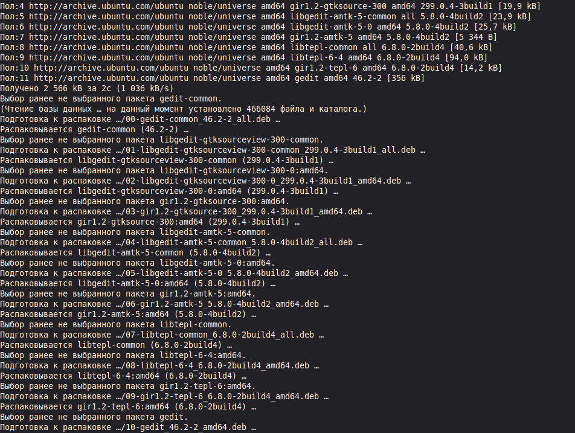

Цель работы
Приобретение навыков работы с системой контроля версий Git и оформления отчетов с использованием Makefile

Ход выполнения работы
1 Перешел в каталог курса командой cd work study 2025-2026 Архитектура компьютера study_2025-2026_arh-pc
2 Обновил локальный репозиторий командой git pull
3 Перешел в каталог с шаблоном отчета для лабораторной работы номер 3 командой cd labs lab03 report
4 Выполнил компиляцию шаблона командой make
При этом сгенерировались файлы report pdf и report docx
5 Удалил сгенерированные файлы командой make clean
6 Открыл файл report md в редакторе gedit и изучил его структуру
7 Заполнил отчет текстом и добавил скриншоты в папку image
8 Снова выполнил компиляцию командой make
9 Загрузил изменения на GitHub командами git add точка git commit am feat main add files lab-3 и git push

Вывод
В ходе работы я научился работать с системой контроля версий Git использовать Makefile для генерации отчетов и загружать изменения в удаленный репозиторий

Скриншоты

