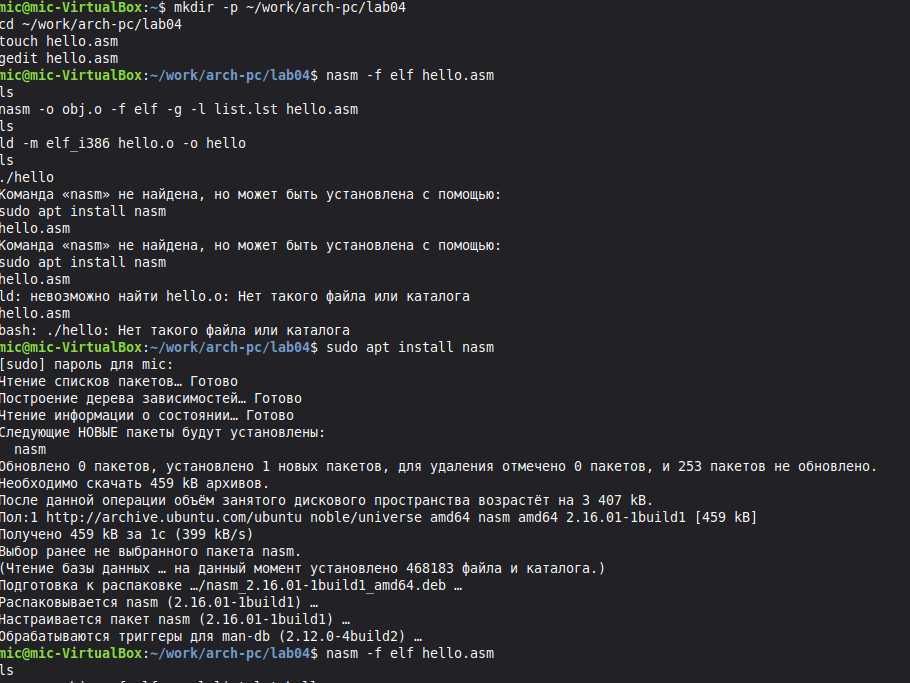
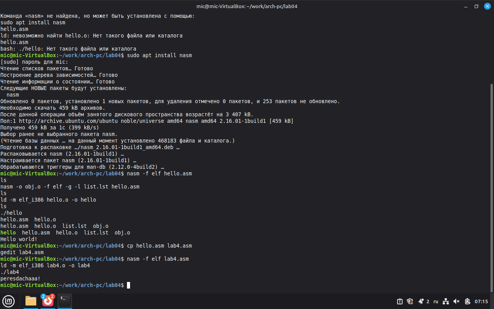

Лабораторная раьота 4
Введение в язык ассемблера NASM

Студент: Гужва Михаил
Группа: НПИ-03
Курс: Архитектура компьютера
Дата: 26.03.2026

Цель работы
Изучение основ языка ассемблера NASM, компиляции и компоновки программ.

Ход выполнения работы
1 Создал каталог ~/work/arch-pc/lab04
2 Создал файл hello.asm с программой Hello world
3 Оттранслировал файл командой nasm -f elf hello.asm
4 Выполнил компоновку командой ld -m elf_i386 hello.o -o hello
5 Запустил программу ./hello
6 Скопировал hello.asm в lab4.asm
7 Изменил текст программы на вывод фамилии и имени
8 Оттранслировал и скомпоновал lab4.asm
9 Запустил программу ./lab4
10. Добавил файлы в репозиторий и загрузил на GitHub

Скриншоты

Вывод
В ходе работы я научился писать простые программы на ассемблере NASM компилировать их и компоновать в исполняемые файлы

Ссылка на репозиторий
https://github.com/mik5121/study_2025-2026_arh-pc/tree/main/labs/lab04
